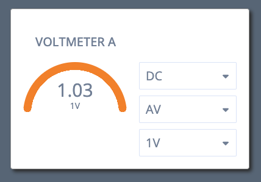

# About

This app is a Voltmeter web component made with LitElement. It uses the ws Websocket library and is styled with vanilla css.
   

   

The project is based on the LitElement TypeScript starter template from the `lit-starter-ts` package in [the main Lit repo](https://github.com/lit/lit).

## Setup

Install dependencies:

```bash
npm i
```

## Build

To build the JavaScript version of your component and watch files and rebuild when the files are modified, run the following command:

```bash
npm run build:watch
```

## Node Websocket Server

To run the node server that sends and receives websocket messages to and from the voltmeter:

```bash
node server.js
```

## Dev Server

To run the dev server and open the project in a new browser tab:

```bash
npm run serve
```